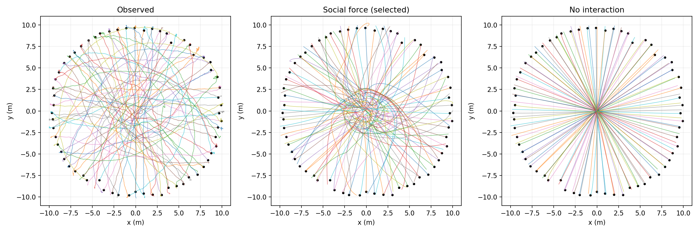
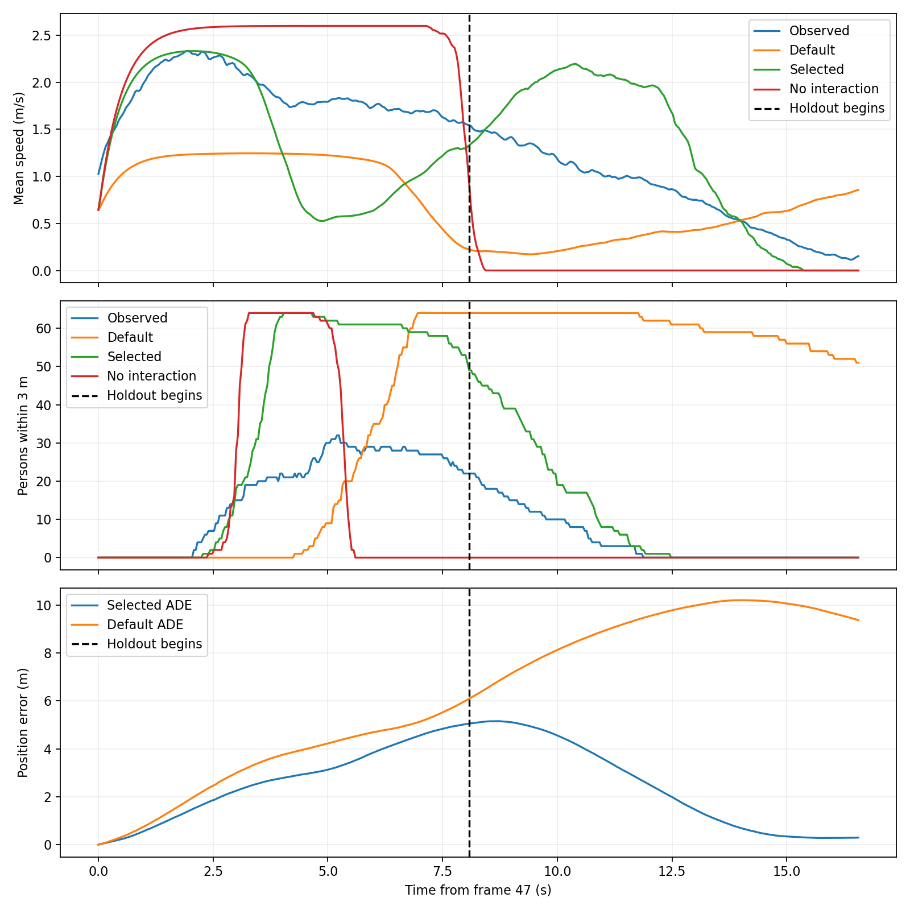
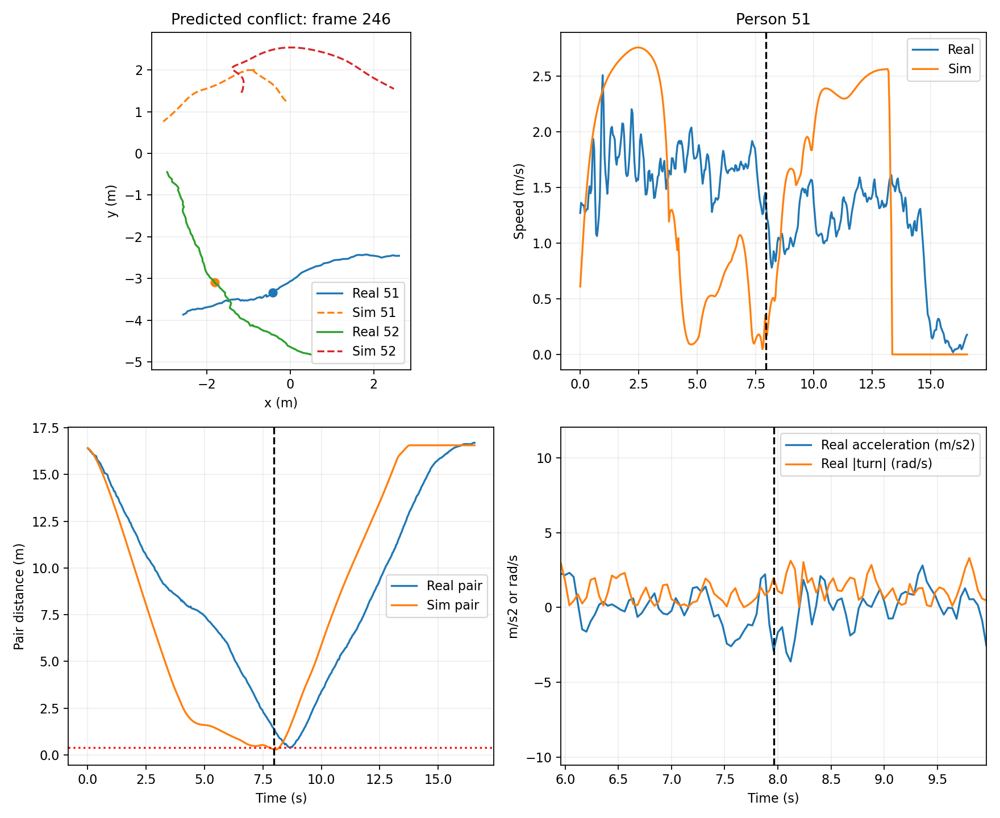
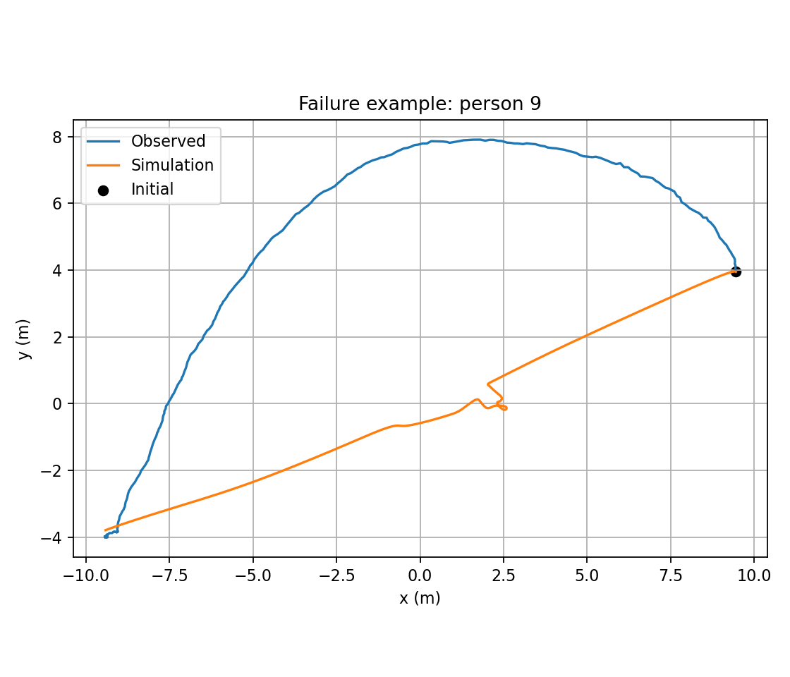

# Week 02：先复现圆周对径穿越，再判断社会力模型

本项目实际调用指定仓库的仿真器，从真实状态开始完成 64 人圆周对径穿越复现。结果属于**机制复现与误差验证**：能否复现中心汇聚、减速和绕行，要结合下面的图与数值判断，不能仅凭轨迹图相似就宣称复现成功。它不是沿环形通道行走，也不是已训练好的 Deep Social Force 神经网络模型。

**结论：目前只部分复现到位。**改进参数后全部行人能在观测时间内到达对径附近，出现局部绕行和相互作用减速；但留出 ADE 仍为 2.442 m，速度 MAE 为 0.825 m/s。模拟中心 3 m 人数峰值为 64，真实为 32；接触风险对-帧 2375 也高于真实 253。因此“正确完成目的地任务”得到支持，“合理重现高密度避让全过程”尚未成立。

## 1. 先看复现结果

打开 [同步回放](results/replay.html)，可播放、暂停、拖动时间；左侧是真实轨迹，右侧是自主仿真。HTML 自带数据，无须联网或启动服务。





|方案|全程 ADE (m)|留出 ADE (m)|末帧 FDE (m)|留出速度 MAE (m/s)|全程 <0.4 m 对-帧|到达比例|
|---|---:|---:|---:|---:|---:|---:|
|真实数据|0.000|0.000|0.000|0.000|253|100.0%|
|上游默认势函数|6.253|9.042|9.362|0.857|1780|3.1%|
|前半段选参|2.542|2.442|0.299|0.825|2375|100.0%|
|关闭人际作用|2.721|2.138|0.315|0.810|12263|100.0%|


ADE 是同一行人同一帧的位置欧氏误差均值；FDE 是最后一帧误差均值。留出速度 MAE 是逐人逐帧速率绝对误差均值。到达比例指末帧距几何对径目标 <0.75 m；<0.4 m 对-帧是无序行人对距离小于该阈值的累计帧数，同一对连续接近会重复计数，**不是独立碰撞次数**。真实轨迹也可能因身体宽度或跟踪误差出现小距离，0.4 m 只是统一的接触风险代理。第一帧位置相同不代表未来轨迹准确。

选参模型（elliptical）全程最近距离为 0.006 m，末帧到达率 100.0%，留出 ADE 为 2.442 m。无相互作用对照的 <0.4 m 对-帧为 12263，选参模型为 2375。这能检验人际排斥是否降低接触风险，但不直接证明它正确复现了个体避让时机。图 02 同时展示速度变化和中心 3 m 区域人数；对汇聚峰值及疏散节奏的差异也要保留。

|方案|中心 3 m 内人数峰值|峰值时间 (s)|平均最小离心距离 (m)|
|---|---:|---:|---:|
|真实数据|32|5.20|2.202|
|默认势|64|6.96|1.068|
|选参模型|64|4.04|0.995|
|无相互作用|64|3.28|0.070|


平均最小离心距离衡量是否普遍贴近中心穿越；它能量化绕开中心的程度，但不是独立的避让动作识别。峰值时间从第 47 帧算起；若多人峰值存在平台，报告首次达到峰值的时间。

## 2. 数据与实验设定

唯一输入是上一级的 `circle-10m-64-1.txt`，共 27,200 行、64 个 ID、425 个共同帧（37—461），无缺失帧。列按 `ID frame x y auxiliary` 读取；第五列只有 160/170/180，含义未确认，未用于仿真。未收到原始视频、数据字典或帧率元信息。

坐标按厘米转为米（乘 0.01）是推断：此时起始半径均值约 10.069 m，与文件名一致；真实终点到负起点的平均偏差约 0.286 m、最大约 0.635 m，支持对径穿越设定。25 fps 是待核实假设，时间和速度均以此为条件；20/30 fps 的替代结果见敏感性表。不能由“速度看起来合理”反过来证明帧率。原点采用文件坐标原点，没有用未来终点去拟合圆心。

数据 SHA-256：`05d52540e3a4f427f52627cc4aaf9c7d1dde7228ca5513995284d0f52f14d790`。

复现步骤：

1. 用第 37—47 帧的位置做直线回归，估计初始速度；从**第 47 帧真实位置**开始自主预测到第 461 帧。前 11 帧是起步观测窗口，不计入预测评价。没有把未来帧作为每步速度或位置输入。
2. 目标固定为各人第 37 帧位置的负值，即几何对径点；不用真实最终位置或真实中途路径作为导航点。松弛时间 0.5 s；期望速度为全员共享的候选参数，不是测得的个人偏好。
3. 先运行上游默认势参数 A=2.1、B=0.3、无非对称性，期望速度 1.3 m/s。首轮 8 组椭圆势网格暴露出速度不足和中心长时拥堵；再增加仓库现成的 Diamond 势 8 组（A=2.1、B∈{0.5,0.8}、非对称参数∈{0,0.2}、期望速度∈{2.2,2.6}），以及 2 组较高期望速度的椭圆势对照。2.2/2.6 m/s 候选由真实前段群体速度量级启发；共有 18 组，最终仍按第 47—248 帧的位置 ADE 选择。选中势类型 elliptical、A=2.1、B=0.5、非对称参数=0.0、期望速度=2.6 m/s。完整候选与目标值在 `results/report.json` 的 grid 中。
4. 第 249—461 帧为时间留出：仿真不重置状态、不在线更新参数。不过在首轮结果检查之后扩展了模型候选，因此这是探索性留出评价，不能当作从未查看过的独立测试集。第一段是校准结果，也不应报告成泛化精度。还需要另一场实验做独立验证。
5. 无墙体、无圆周约束。圆是起终点布置而非实体障碍；不添加不存在的环形墙。添加统一到达规则：距目标 0.5 m 内按距离降低期望速度，进入 0.15 m 后冻结位置；停下者仍作为其他人的排斥来源。

## 3. 两条可检验的行为判断

真实速度用 11 帧二阶 Savitzky–Golay 平滑后差分，平滑只用于事后分析，未输入未来仿真。预测冲突按当前相对位置和速度做匀速外推：未来 0.05—2 s 内最近距离 <0.6 m、当前距离 <3 m 即标记风险。这里的“冲突”是潜在接近，不是已发生碰撞。

减速标记为切向加速度 <−0.3 m/s²；转向标记为速率 >0.3 m/s 且 |航向角速度| >0.35 rad/s。避让候选须同时出现风险和减速或转向，再从配对距离曲线检查是否重新分离；光凭弯曲轨迹不能断言避让动机。

**判断 H1：预测冲突状态的平均切向加速度低于非冲突状态。**限定起步后 1—12 s、速率 >0.3 m/s，逐人比较风险与安全样本，各类至少 5 帧。共有 63 人满足条件；风险减安全加速度差的逐人均值为 -0.178 m/s²，负差比例 66.7%。方向上支持 H1，但证据是关联而非因果。

**判断 H2：预测冲突状态的平均绝对转向速率高于非冲突状态。**同样逐人比较，风险减安全的均值差为 0.058 rad/s，正差比例 52.4%。方向上支持 H2。每人差值保存在 `results/behavior_per_person.csv`。帧高度相关、行人彼此耦合，也未匹配密度和实验时间；不把数万帧当作独立样本，不宣称统计显著或因果成立。复核时可改变风险阈值和平滑窗；后续新实验如果差值翻转即可反驳这两条判断。



图 03 选取真实风险状态中同时减速与转向的强事件（限制加速度 −3 至 −0.3 m/s²、绝对角速度 0.35 至 2 rad/s，避开极端导数尖峰）：第 246 帧，行人 51 与满足预测冲突条件的 52，间距 1.409 m，预测最近接近时间 0.676 s、预测最小间距 0.053 m。行人 51 的切向加速度为 -2.883 m/s²，角速度为 -1.976 rad/s。图中比较同一 ID、同一时间的路径、速度和对距；模拟未必在此时与此人相遇，这种事件配对不一致也是失效证据。此图是挑选的强事件示例，不代表所有人的平均表现。全体行为统计未删除极端导数，仍需谨慎。

## 4. 模型主张及依据：行人如何运动

主张是：**朝对径目标运动的驱动力，加上有前向预测尺度和视野加权的人际排斥，能够产生中心汇聚时的减速及局部绕行；单靠该机制不足以保证准确的个体通行顺序。**这是一条待验证的最小机制主张，不能因程序跑通就认定全部成立。

使用上游 `socialforce.Simulator` 的动力学：

```text
dr_i/dt = v_i
dv_i/dt = (v0_i e_i − v_i)/tau_i + sum_j w_ij (−grad_ri V_ij)
e_i = (goal_i − r_i) / |goal_i − r_i|
b_ij = 0.5 sqrt((|r_ij| + |r_ij − s_j e_j T|)^2 − (s_j T)^2)
V_ij = A exp(−b_ij/B) × softplus(a r_perp_ij)/log(2)
```

上式 V 是椭圆势：无非对称性时乘子为 1，严格等同上游默认椭圆势函数；验证脚本直接比较两类势函数的梯度。Diamond 候选改用上游尖端分段线性势：`V=A max(1−0.5 (|r_perp|/B_perp + |r_parallel|/B_parallel),0)`，其中 `B_perp=B(1+a sign(r_perp))`，邻人的前方 `B_parallel=B+T s_j`、后方为 B。其尖端和有限作用范围旨在缓解迎面锁死，没有自编横向推力或手工中途导航点。椭圆势的 a 与米坐标相乘，Diamond 的 a 为左右尺度相对偏差，两者不可直接当成同一物理量。

A 为势函数幅度（m²/s²），B 为作用距离（m）；T=0.4 s 是上游势函数的预测尺度，区别于积分时间步。`s_j` 是邻人的当前速率、`e_j` 是其目标方向；这不是直接预测所有人的真实未来轨迹。200° 视野内权重 1，视野外 0.5。驱动力使行人恢复期望速度，前方排斥的反向分量引起减速，侧向分量引起转向；非对称势可改变左右绕行偏好，但本数据没有证明普遍靠左或靠右。

采用上游 Leapfrog 积分，每观测帧 4 个子步，主设定约 0.01 s；速度上限为动态期望速度的 1.3 倍。边界力未启用。我们编写的是数据读取、实验适配、到达规则、选参与评价，**没有另写一个公式相似的 NumPy 模型冒充指定仓库**。也没有训练 MLP 势函数或用大模型逐帧决定动作。

## 5. 哪些证据支持模型，何时失效

参数选择只最小化前段位置 ADE，没有接触风险约束；所以选参结果不能视为最安全或最合理的参数。H2 正差比例接近一半，跨个体一致性较弱。支持证据需联合检查：图 01 的局部绕行；图 02 的中心汇聚、速率变化及留出误差；关闭相互作用对照的接触风险变化。数据行为差值提供机制动机，不能替代仿真验证。模型只在表中误差和图中事件一致的范围内得到支持；不能宣称逐人轨迹或避让全过程已准确重现。



实际最差个体为 ID 9，全程 ADE 5.846 m。图 04 保留其真实与模拟路径，展示全局参数模型对个体绕行路线的偏差。尤其在中心高密度多人交会时，微小偏移能改变谁先通过、与谁冲突；连续软排斥没有人体硬接触约束，短距离穿透与死锁不能被排除。若末帧到达率不足 100%，说明在观测时间内仍未完成对径任务；即使到达，较大 ADE 仍代表路线或节奏复现不足。

|检查|留出 ADE (m)|留出速度 MAE (m/s)|留出 <0.4 m 对-帧|最大速度 (m/s)|有限值|
|---|---:|---:|---:|---:|---|
|initial_noise_2cm_seed_1|2.693|0.867|674|3.149|True|
|initial_noise_2cm_seed_2|2.645|0.861|691|3.165|True|
|initial_noise_2cm_seed_3|2.656|0.896|431|3.345|True|
|integration_8_substeps|2.371|0.810|582|3.244|True|
|assumed_fps_20|1.991|0.714|107|3.292|True|
|assumed_fps_30|4.322|1.178|1308|3.186|True|


噪声检查给初始位置加入每坐标标准差 2 cm 的高斯扰动，其他设定不变；积分检查改为 8 子步；帧率检查同时改变实际时间跨度、初始速度和真实速度，参数不重新拟合。因此帧率行是单位假设的敏感性，不是三次独立实验。有限值为真只说明无 NaN/Inf；误差、接触风险和未到达都属于行为失效，需要一起报告。

另有可复现数值失效：上游 `cap_velocity` 在期望速度和实际速度都为 0 时会做 0/0，产生 NaN。直接的停止实现曾使无相互作用对照中断；实验适配层将进入停止区的临时期望速度设为 1e−6，在调用后恢复并冻结位置和速度，避免改变上游源码。`model/validate.py` 独立复现 0/0 并核查交付轨迹为有限值。这是数值修复，不是行为拟合改善。

局限还包括：单位/帧率未确认；期望速度、反应时间全员相同；忽略启动时间差、身体大小、群组关系、视线遮挡、接触摩擦和个人策略；只有一个实验、18 组粗候选且经历探索；行为指标来自平滑估计且阈值人为设定。中心汇聚趋势与局部避让可由该模型解释，但个体避让时刻、伙伴和绕行侧选择不能由当前结果可靠预测。需要数据字典与额外实验才能扩展结论。

## 6. 使用的资料、开源代码与大模型

- 用户提供的本地轨迹文件，是唯一真实实验输入。
- [svenkreiss/socialforce](https://github.com/svenkreiss/socialforce)，MIT 许可证，源码保存在 `model/vendor/socialforce`，固定提交 `8d1fba69667f949175dc8575857fb4780afedb9a`，包版本 0.2.3。`Simulator`、势函数、视野与积分器均实际使用；许可证保留。
- [Sven Kreiss, Deep Social Force (2021)](https://arxiv.org/abs/2109.12081)：支持采用可微势函数检验相互作用机制，指出经典模型的正面对撞锁死和非对称势的绕行偏好问题；本文未复现该论文训练流程，未声称训练神经网络。
- [Investigation of pedestrian dynamics in circle antipode experiments (2019)](https://www.sciencedirect.com/science/article/abs/pii/S0968090X18312610)：其公开摘要/检索信息描述半径 5/10 m、含 64 人配置的圆周对径实验，作为实验类型背景；未能核实本文件就是该论文发布数据，不把来源相似视为数据出处证明。
- 大模型：本任务由 OpenAI Codex 会话协助编写代码、设计评价与撰写说明；当前会话未提供可核实的具体模型版本，所以不虚构版本号。所有图表和数值由本地 Python 实际计算，大模型未生成实验观测、未作为运行时行人策略。

## 7. 运行与文件说明

在原来的 `week2` 目录执行（Python 3.10+，CPU 即可）：

```powershell
python -m pip install -r week02/model/requirements.txt
python week02/model/run.py
python week02/model/validate.py
python week02/model/write_readme.py
```

本次环境：Python 3.12.4，NumPy 1.26.4，SciPy 1.13.1，Matplotlib 3.8.4，PyTorch 2.7.0+cu118。随机扰动种子固定为 1/2/3，主实验无随机噪声；所有运算使用 CPU。没有要求额外下载轨迹数据。

```text
week02/
  README.md                 本报告
  model/
    run.py                  真实起步、自主仿真、对照、选参、绘图与回放
    validate.py             结果核查、势函数等价检查、NaN 失效复现
    write_readme.py          从计算结果生成报告
    requirements.txt
    vendor/socialforce/     指定开源项目及其 MIT 许可证
  results/
    01_trajectories.png      全体路径比较
    02_dynamics.png          速度、中心人数、位置误差
    03_conflict_event.png    真实配对事件与模拟比较
    04_failure.png           最差个体路径
    replay.html              同步可拖动回放
    report.json              全部参数、网格、指标和敏感性
    trajectories.npz         真实与模拟轨迹及速度（米、秒）
    frame_comparison.csv     每帧位置、速度与行为标记
    behavior_per_person.csv  两条判断的逐人差值
    validation.json          数值与交付核查结果
```

复现命令会覆盖当前结果文件。输入路径相对脚本定位，保留上一级原始文件即可在任意工作目录运行；README 由实际结果生成，避免手工填写指标与脚本不一致。
