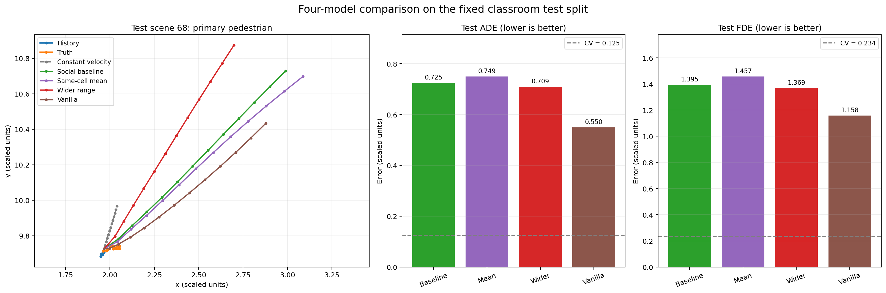

# Week 3：TrajNet++ 邻居信息实验总结

## 1. 四个模型的区别

| 模型 | 是否使用邻居 | `n` | `cell_side` | 邻域总边长 | 同格邻居汇总 | 参数量 |
|---|---|---:|---:|---:|---|---:|
| 原版 Social LSTM 基线 | 是 | 4 | 1.0 | 4 | 原始索引写入（同格可能覆盖） | 25,777 |
| 同格平均池化 Social LSTM | 是 | 4 | 1.0 | 4 | 同格有效邻居特征取平均 | 25,777 |
| 扩大邻域 Social LSTM | 是 | 4 | 1.5 | 6 | 原始索引写入（同格可能覆盖） | 25,777 |
| Vanilla LSTM 无交互基线 | 否 | — | — | — | 无池化模块 | 13,193 |

四个模型使用相同的数据划分、目标行人、8个历史点、12个未来点、随机种子42、训练轮数10和评价脚本。三个 Social LSTM 的主体网络和参数量相同；平均池化模型只改变同格汇总规则，扩大邻域模型只将 `cell_side` 从1.0调整为1.5。Vanilla LSTM 移除了邻居池化模块，因此网络结构和参数量也发生了变化。

## 2. 四个模型的特点

### 2.1 原版 Social LSTM 基线

原版模型将每个行人的邻居按照相对位置放入 `4×4` 网格，并把邻居的 LSTM 隐藏状态编码后加入目标行人的预测。每格边长为1个换算后坐标单位，整个邻域边长为4。上游实现使用索引赋值填格，因此多个邻居落入同一格时并不是显式求和或平均，部分邻居特征可能被覆盖。

### 2.2 同格平均池化 Social LSTM

该模型保持网格范围、网络维度和参数量不变，只修改同格邻居的汇总规则。实现使用 `scatter_add` 累加同格有效邻居特征，再除以该格邻居数；越界邻居不参与，空格保持为零，而且梯度能够传递到所有有效邻居。

这种规则消除了原始覆盖行为对邻居排列顺序的依赖，但平均操作也会削弱个别关键邻居的特征，并且无法区分同格内一个人与多个人。

### 2.3 扩大邻域 Social LSTM

该模型固定网格数 `n=4` 和原始覆盖规则，将 `cell_side` 从1.0扩大到1.5，因此邻域总边长由4增加到6，模型参数量不变。扩大范围后，目标行人能够接收更远邻居的信息；与此同时，每个网格覆盖的空间也更大，空间划分比原版更粗。

### 2.4 Vanilla LSTM 无交互基线

Vanilla LSTM 只使用目标行人自身的历史轨迹，不使用任何邻居池化信息。它的参数量和训练时间明显少于 Social LSTM。该模型可以初步回答“邻居信息是否帮助预测”，但由于它同时改变了网络结构和参数量，不能把与 Social LSTM 的全部差异都归因于邻居信息。

## 3. 测试集结果

ADE 和 FDE 均为误差指标，数值越低越好。ADE 是全部12个预测时刻的平均位移误差，FDE 是最后一个预测时刻的平均位移误差。

| 排名 | 模型 | Test ADE | Test FDE | 训练时间 | 参数量 |
|---:|---|---:|---:|---:|---:|
| 1 | **Vanilla LSTM 无交互基线** | **0.5498** | **1.1583** | 22.18秒 | 13,193 |
| 2 | 扩大邻域 Social LSTM | 0.7095 | 1.3694 | 46.91秒 | 25,777 |
| 3 | 原版 Social LSTM 基线 | 0.7249 | 1.3950 | 46.66秒 | 25,777 |
| 4 | 同格平均池化 Social LSTM | 0.7494 | 1.4571 | 49.18秒 | 25,777 |

匀速外推参考的 Test ADE 为0.1251、Test FDE为0.2339。四个学习模型均未超过匀速外推。

## 4. 四模型测试集对比图

下图左侧使用测试集第一条场景（scene 68）的同一个主要目标行人，比较8个历史点、真实未来、匀速外推以及四个模型的12步预测；右侧汇总全部12个测试场景的 ADE 和 FDE。单个场景图用于解释案例，最终优劣以全部测试场景的汇总指标为准。



该图可通过以下命令重新生成：

```powershell
.\.venv\Scripts\python.exe compare_four_models.py
```

## 5. 结果分析

1. **扩大邻域是三个 Social LSTM 中效果最好的方案。** 与原版 Social LSTM 相比，其 Test ADE 从0.7249下降到0.7095，降低约2.13%；Test FDE从1.3950下降到1.3694，降低约1.84%。这说明在当前小样本中，更远处的邻居信息可能提供了一定帮助，但提升幅度较小。

2. **同格平均池化没有改善效果。** 相比原版，平均池化的 Test ADE 上升约3.4%，Test FDE上升约4.5%。可能原因是平均操作削弱了关键邻居特征，同时丢失了同格邻居数量信息。这是本实验中的修改失效案例。

3. **Vanilla LSTM 是四个学习模型中表现最好的。** 与效果最好的 Social LSTM（扩大邻域）相比，Vanilla 的 Test ADE降低约22.5%，Test FDE降低约15.4%，参数量减少约48.8%，训练时间约缩短一半。在当前数据和训练配置下，现有 Social Pooling 没有产生有效增益，邻居特征反而可能引入噪声。

4. **不能仅凭 Vanilla 与 Social 的差异断言邻居一定无用。** Vanilla 同时移除了池化网络，模型结构和参数量都发生变化。若要更严格隔离邻居信息的作用，应在保持 Social LSTM 结构不变的情况下将邻居特征置零并重新训练。

## 6. 实验配置与复现命令

```powershell
# 原版 Social LSTM
.\.venv\Scripts\python.exe run_classroom.py --output baseline

# 同格平均池化 Social LSTM
.\.venv\Scripts\python.exe run_classroom.py --same_cell_aggregation mean --output social_mean

# 扩大邻域 Social LSTM
.\.venv\Scripts\python.exe run_classroom.py --n 4 --cell_side 1.5 --same_cell_aggregation overwrite --output wider_range

# Vanilla LSTM 无交互基线
.\.venv\Scripts\python.exe run_classroom.py --type vanilla --output no_neighbours
```

各模型训练完成后，使用同一测试协议评价：

```powershell
.\.venv\Scripts\python.exe evaluate_classroom.py <模型文件.pkl> --split test
```

## 7. 实验局限

- 坐标乘以0.01以及原始帧率25 fps均是未经元数据确认的假设，因此本文只使用“换算后坐标单位”，不将误差直接解释为真实米数或时间。
- 训练、验证和测试分别只有56、12和12个场景，部分窗口重叠，不能代表新场景上的泛化能力。
- 测试集来自时间后段，轨迹可能比训练阶段更平稳，不能把所有差异完全归因于邻居机制。
- 四个模型均只训练10轮，属于课堂CPU小样本实验，不是对完整 TrajNet++ 论文结果的复现。
- 最终测试集被用于比较四个已完成模型；不应继续根据测试结果反复调参。

## 8. 代码与输出

- `trajnetbaselines/lstm/gridbased_pooling.py`：同格平均池化实现。
- `trajnetbaselines/lstm/trainer.py`：增加 `--same_cell_aggregation` 参数。
- `evaluate_classroom.py`：统一计算 ADE、FDE、匀速参考和参数量。
- `compare_four_models.py`：生成四模型测试集对比图。
- `assets/four_models_test_comparison.png`：供 GitHub Markdown 显示的提交用对比图。
- `OUTPUT_BLOCK/circle_classroom/`：模型、训练记录、评价指标及图片。

源码来自 EPFL VITA TrajNet++ Baselines，固定版本与课堂改动记录见 `classroom/SOURCE_AND_CHANGES.md`。
